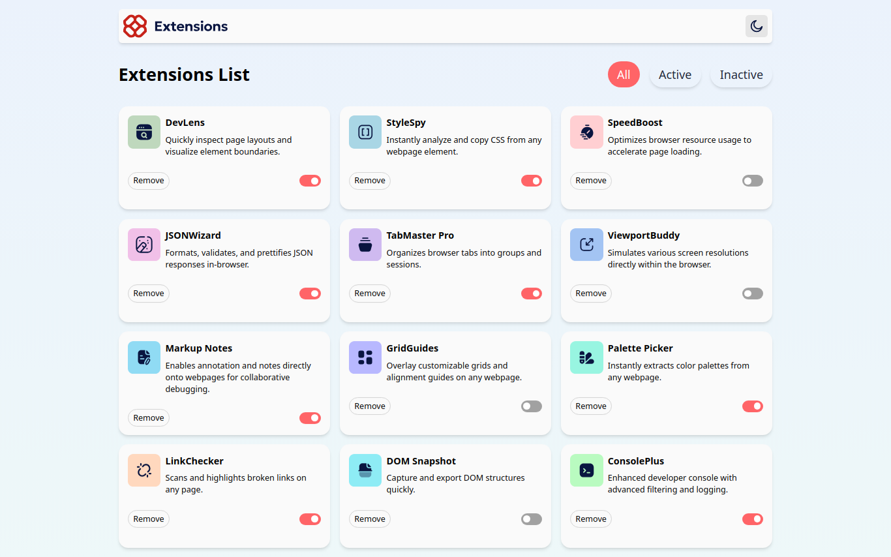
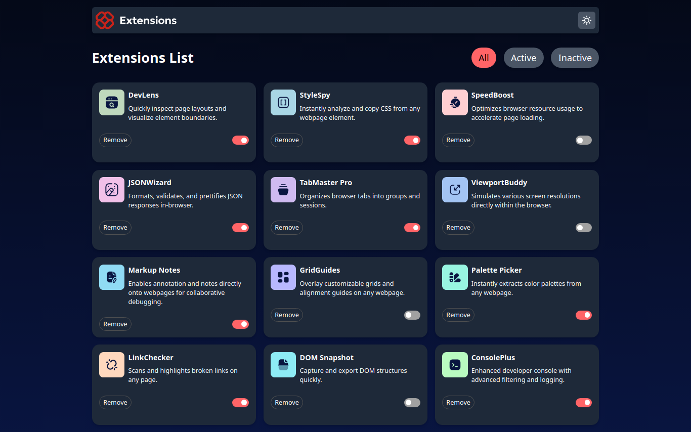
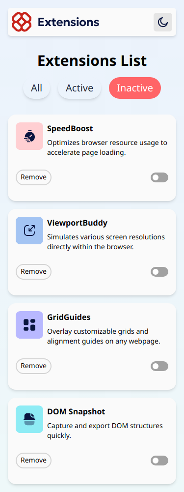
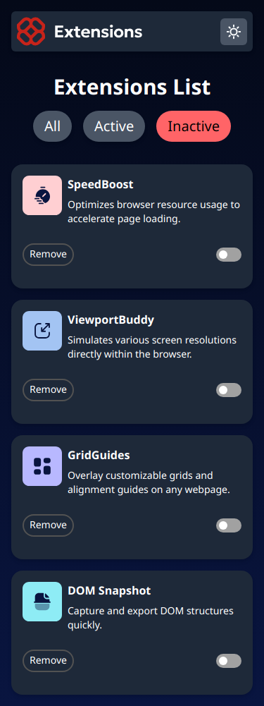

# Frontend Mentor - Browser extensions manager UI solution

This is a solution to the [Browser extensions manager UI challenge on Frontend Mentor](https://www.frontendmentor.io/challenges/browser-extension-manager-ui-yNZnOfsMAp).

## Table of contents

- [Overview](#overview)
  - [The challenge](#the-challenge)
  - [Links](#links)
  - [Screenshot](#screenshot)
- [My process](#my-process)
  - [Built with](#built-with)
- [Author](#author)

## Overview

### The challenge

Users should be able to:

  - Toggle extensions between active and inactive states
  - Filter active and inactive extensions
  - Remove extensions from the list
  - Select their color theme
  - View the optimal layout for the interface depending on their device's screen size
  - See hover and focus states for all interactive elements on the page

### Links

- Solution URL: [solution](https://github.com/Medido1/Frontend-Mentor-Browser-extensions-manager-UI)
- Live Site URL: [live site](https://broswerextentionmanager.netlify.app/)

### Screenshot

  ## Desktop light mode
  

  ## Desktop dark mode
  

  ## Mobile light mode
  

  ## Mobile dark mode
  

## My process

### Built with

- React
- Tailwindcss
- Flexbox
- Grid
- Mobile-first workflow

## Author

- Frontend Mentor - [@Medido1](https://www.frontendmentor.io/profile/Medido1)
- GitHub - [@Medido1](https://github.com/Medido1)